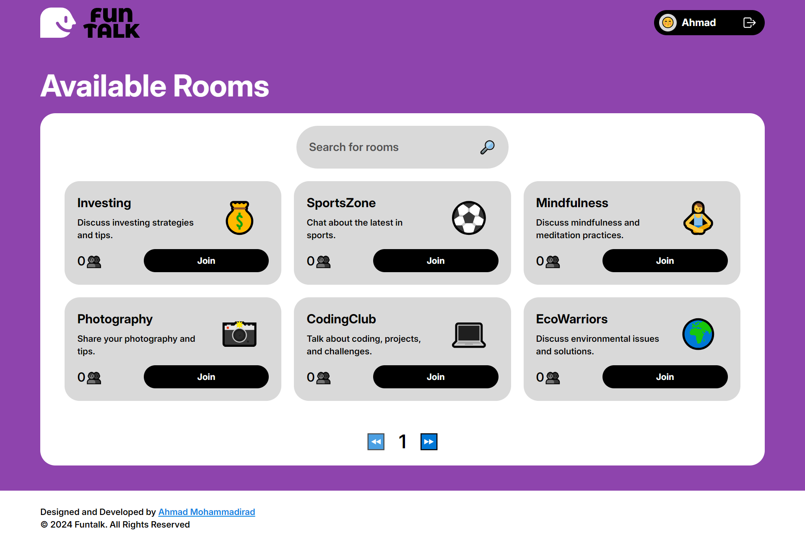
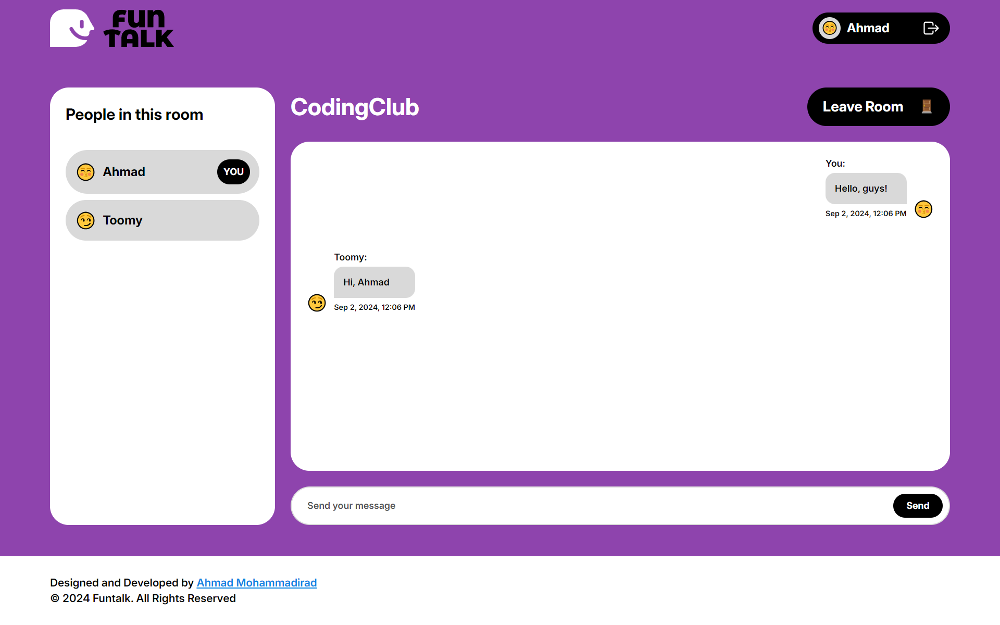
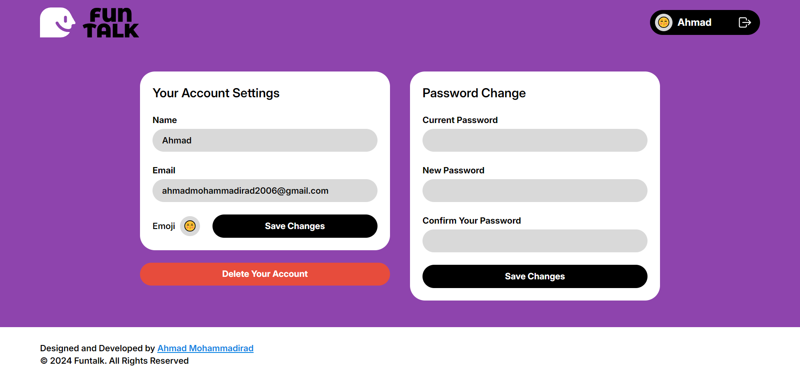

# FunTalk

FunTalk is a simple, real-time chat application that allows users to join topic-based chat rooms, interact with others, and manage their accounts. This project marks my first full-stack development endeavor, built with a focus on learning and experimentation.

## Features

- **User Authentication**: Sign up, log in, and manage your account settings.
- **Real-Time Chat**: Join rooms based on different topics and chat with others in real time.
- **Room Presence**: See who is currently in the same chat room (though the implementation may have some issues in certain cases).
- **Account Management**: Update your profile, change your password, and delete your account if needed.

## Screenshots

### Home page:


### Rooms page:


### Chat page:


### Profile page:



## Tech Stack

- **Frontend**: HTML, TailwindCSS, Pure JavaScript
- **Backend**: Node.js, Express.js
- **Database**: MongoDB
- **Real-Time Communication**: Socket.io

## Installation

To get started with FunTalk, follow these steps:

1. **Clone the repository**:
   ```bash
   git clone https://github.com/yourusername/funtalk.git
   cd funtalk
   ```
2. **Install dependencies:**
   ```bash
   npm install
   ```
3. **Set up environment variables**: Create config.env file in the server folder and add the following variables:

   ```makefile
   NODE_ENV=development
   PORT=8080

   DATABASE=your_mongodb_connection_string
   DATABASE_PASSWORD=your_database_password

   JWT_SECRET=your_jwt_secret_key
   JWT_EXPIRES_IN=expiration_time_for_jwt
   JWT_COOKIE_EXPIRES_IN=expiration_time_for_jwt_cookie

   EMAIL_USERNAME=your_email_username
   EMAIL_PASSWORD=your_email_password
   EMAIL_HOST=your_email_host
   EMAIL_PORT=your_email_port

   EMAIL_FROM=your_email_address
   ```

4. **Run the application:**
   ```bash
   npm start
   ```

The app should now be running on the port specified in the .env file.

## Known Issues & Future Improvements

As this is my first full-stack project, there are several areas where the app can be improved:

- **Room Presence**: The feature to track users in a room may have some issues and needs refinement.
- **Responsive Design**: The app can be used on different devices, but the design is basic and will be improved in the future.
- **Security Enhancements**: Implement better authentication and data validation practices.
- **Performance Optimization**: Refine the backend code to handle larger volumes of users and messages.
- **UI/UX Improvements**: Enhance the user interface for a more polished and professional look.
- **Additional Features**: Add features like private messaging, notifications, and media sharing.

I plan to continually improve FunTalk as I learn more about web development and new technologies.

## Contributing

If you're interested in contributing to FunTalk, feel free to fork the repository and submit a pull request. Any suggestions, bug reports, or feature requests are welcome!
